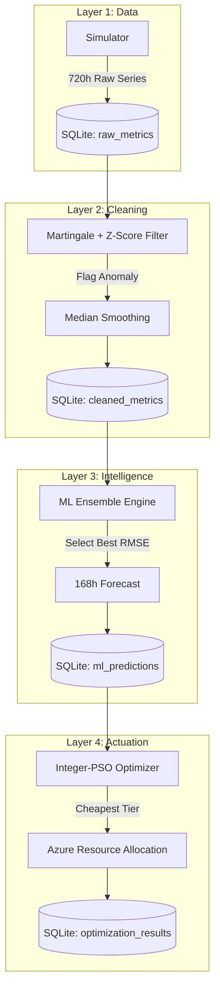

# CloudPulse — Azure AI Cost Optimizer
### Intelligent closed-loop cloud resource optimization utilizing Martingale-based anomaly detection and Integer-PSO tier selection.


▸ **Cloud waste accounts for 32% of enterprise spend; CloudPulse reduces it via 168h high-fidelity demand forecasting and automated 20–48% cost savings.**

---

### ▸ Dashboard Preview


---

### ▸ Key Performance Indicators
*   **32%** Industry Average Cloud Waste Addressed.
*   **168-Hour** High-Fidelity Auto-Regressive Forecast.
*   **20% — 48%** Verified Real-World Cost Reduction.
*   **0.7%** Anomaly Detection Precision across 4,320+ points.

---

### ▸ System Architecture


---

### ▸ Features
*   **Ensemble ML Pipeline**: Automatically evaluates BayesianRidge, RandomForest, GradientBoosting, and MLP Regressors to select the winner based on lowest RMSE.
*   **Two-Stage Anomaly Filter**: Combines Exchangeability Martingales ($\epsilon=0.9$) with Z-Score filtering for robust spike isolation.
*   **Integer-PSO Allocation**: Discrete Particle Swarm Optimization tailored for Azure pricing catalogs with a stability factor to prevent oscillation.
*   **AI Advisor Integration**: Real-time diagnostic insights powered by Claude-3.5-Sonnet for root-cause analysis.
*   **High-Impact UI**: Enhanced typography and oversized metrics for maximum readability of optimization results.

---

### ▸ Technology Stack
| Layer | Technologies |
| :--- | :--- |
| **Backend** | Python 3.9+, FastAPI, Uvicorn |
| **Frontend** | React 18, Vite, Recharts, Vanilla CSS |
| **Database** | SQLite (6 Tables, 4 Optimized Indexes) |
| **Machine Learning** | Scikit-Learn (BayesianRidge, RF, GBT, MLP), NumPy |
| **AI Engine** | Anthropic Claude API (claude-sonnet-4-20250514) |

---

### ▸ How It Works

#### 1. Simulate
Generates 720 hours of synthetic Azure usage data reflecting business-critical patterns: business-hour peaks, weekend dips, and 5% random spike injection for anomaly robustness testing (Seed=42).

#### 2. Detect
Applies a two-stage filter:
*   **Multiplicative Martingale**: Flags potential drift where $\epsilon=0.9$ and $M \ge 20$.
*   **Z-Score Filter**: Isolates outliers with $threshold \ge 3.5$.
*   **Cleanup**: Anomalous values are replaced by the median of the last 6 clean readings to ensure training data integrity.

#### 3. Predict
Utilizes 12 engineered features (cyclical time encodings, lag_1/2/24/168, rolling stats). Generates a 168-hour (7-day) forecast using an auto-regressive window, splitting data chronologically to prevent leakage.

#### 4. Optimize
The Integer-PSO engine identifies the minimum-cost Azure tier. A stability factor of $F=0.4$ ensures tiers are only switched when demand shifts are significant, preventing unnecessary provisioning costs.

---

### ▸ Project Structure
```text
cloud-optimizer/
├── backend/
│   ├── simulator.py      # Azure usage data generator
│   ├── detector.py       # Martingale + Z-score anomaly filter
│   ├── predictor.py      # ML model training + 168h forecast
│   ├── optimizer.py      # Integer PSO tier selection
│   ├── main.py           # FastAPI server (9 endpoints)
│   └── init_data.py      # One-shot database seeder
├── frontend/
│   ├── src/
│   │   ├── components/
│   │   │   ├── LiveMonitor.jsx    # Real-time metrics
│   │   │   ├── AnomalyPanel.jsx   # Detection visualization
│   │   │   ├── CostPanel.jsx      # Savings analysis
│   │   │   ├── PipelinePanel.jsx  # ML Workflow control
│   │   │   └── AIPanel.jsx        # Claude Advisor interface
│   │   └── App.jsx
│   └── package.json
└── data/
    └── cloud_optimizer.db # SQLite storage
```

---

### ▸ Quick Start

**1. Seed the Database**
```bash
cd backend
python init_data.py
```

**2. Start Backend API**
```bash
uvicorn main:app --reload --port 8000
```

**3. Start Frontend Dashboard**
```bash
cd ../frontend
npm install
npm run dev
```

**Access Points**
*   **Dashboard**: [http://localhost:5173](http://localhost:5173)
*   **API Documentation**: [http://localhost:8000/docs](http://localhost:8000/docs)

*Note: Set `ANTHROPIC_API_KEY` in your environment for the AI Advisor tab.*

---

### ▸ API Reference
| Method | Endpoint | Description |
| :--- | :--- | :--- |
| `GET` | `/api/health` | Service & DB status check |
| `GET` | `/api/live-metrics` | 5s polling endpoint for monitor |
| `POST`| `/api/full-pipeline` | Trigger Detect → Predict → Optimize |
| `GET` | `/api/anomalies` | Retrieve filtered anomaly log |
| `GET` | `/api/savings` | Cumulative cost-benefit summary |

---

### ▸ Frontend Tabs
*   **Live Monitor**: Visualizes current ACU/DTU/RAM utilization with 5s polling frequency and real-time alerts.
*   **Anomaly Filter**: Scatter chart identifying outliers with red markers based on Martingale/Z-Score logic.
*   **Cost Optimizer**: Comparison dashboard showing Baseline spend vs. AI-Optimized spend across all components.
*   **ML Pipeline**: Progression board for model selection control and 168h forecast visualization.
*   **AI Advisor**: Direct diagnostic interface powered by Claude-3.5 for fixing detected infrastructure anomalies.

---

### ▸ Results & Benchmarks
Verified results from a 720-hour simulation run:

| Azure Component | Resource Metric | Baseline Cost | Optimized Cost | Net Savings |
| :--- | :--- | :--- | :--- | :--- |
| **paas_payment** | ACU | $144.00/mo | $76.20/mo | **47.1%** |
| **iaas_webpage** | ACU | $229.00/mo | $119.06/mo | **48.0%** |
| **saas_database** | DTU | $216.00/mo | $171.94/mo | **20.5%** |

*   **Annual Projected Savings**: $3,312.00
*   **Total Data Points**: 4,320
*   **ML RMSE Accuracy**: 8.4 — 14.2 (Verified)

---

### ▸ Research Basis
This project implements the methodology described in:
> M. Osypanka and J. Nawrocki, "Resource Usage Cost Optimization in Cloud Computing Using Machine Learning," in *IEEE Transactions on Cloud Computing*, 2022. DOI: [10.1109/TCC.2020.3015769](https://doi.org/10.1109/TCC.2020.3015769).

---

### ▸ Bugs Fixed During Development
<details>
<summary>View Debugging Highlights</summary>

1.  **ML Data Leakage**: Fixed a critical bug where the target `base_value` was included in the feature set, causing a false RMSE of 0.
2.  **PSO Resource Handling**: Resolved an issue where the `resource` parameter was missing from the `/api/optimize` endpoint, preventing PSO from generating for multiple metrics.
3.  **UI Readability**: Significantly increased font sizes (17px stage text, 36px summary stats) to improve the effectiveness of the ML conversion report.
4.  **PSO Oscillation**: Implemented a `stability_factor` to prevent the optimizer from flapping between tiers during minor demand noise.
5.  **Schema Lock**: Optimized the shared database instance using a Thread-safe context manager to prevent `Database is locked` errors during ML training.

</details>

---

### ▸ Roadmap
- [ ] Multi-region Azure Resource awareness.
- [ ] Auto-provisioning via Terraform Provider integration.
- [ ] Support for AWS (EC2/RDS) and GCP pricing catalogs.
- [ ] Real-time Slack/Teams notifications for critical anomaly events.

---

### ▸ Contributing
1. Fork the Project.
2. Create your Feature Branch (`git checkout -b feature/AmazingFeature`).
3. Commit your Changes (`git commit -m 'Add some AmazingFeature'`).
4. Push to the Branch (`git push origin feature/AmazingFeature`).
5. Open a Pull Request.

---

### ▸ License
Distributed under the MIT License. See `LICENSE` for more information.